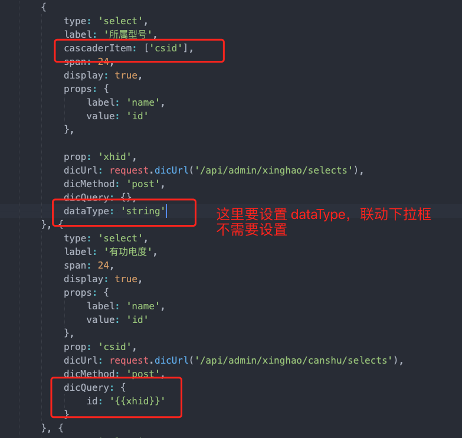

### 常见问题

+ vxe-table 插件加载动画特效时间太长，使用 `<view v-loading="loading">` 包裹 vxe-table 实现加载
+ 体积大的插件在 index.html 中引入，降低开发时编译时间和打包大小
+ avue-form 中的自定义按钮 `<template slot="menuForm”>` 宽度受公共 menuSpan 控制
+ 多级联动，如果二级下拉菜单选择时候显示的是value而不是label，去掉 dataType 参数，并延迟加载

```javascript
this.formValue = row;
this.formDialogShow = true;
if (row.csid) {
    setTimeout(() => {
        this.formValue.csid = parseInt(row.csid)
    }, 500)
}
```

